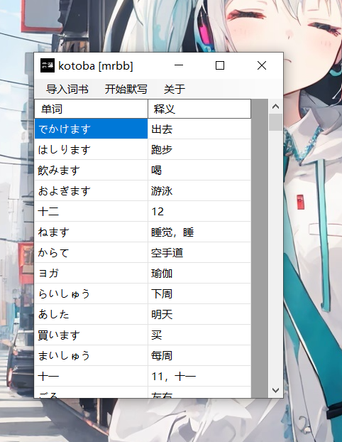

# Kotoba Dictation App

A lightweight Windows Forms application designed for language learners to practice word dictation using custom vocabulary lists.



## Features

- 📥 Import word books (`.words` and `.means` files)
- ✍️ Practice dictation (display meaning → input spelling)
- ✅ Instant answer checking
- 📊 Score and progress tracking
- 🎲 Word order randomized every session
- 📋 Clean and simple UI for focused learning

---

## How to Use

1. **Prepare Word Files**
   - `yourbook.words`: one word per line  
     Example:
     ```
     こんにちは
     ありがとう
     ```
   - `yourbook.means`: one meaning per line (must match word line-by-line)  
     Example:
     ```
     Hello
     Thank you
     ```

2. **Launch the App**
   - Click `Import Book` to select the two files.
   - You will see the word list displayed in a table.

3. **Start Dictation**
   - Click `Start Dictation`.
   - The app shows the meaning, and you type the corresponding word.
   - Click `Check` or press Enter to verify your answer.
   - The app shows results and moves to the next question after a short delay.

4. **At the End**
   - You’ll see your final score and accuracy.
   - The app closes automatically after completion.

---

## File Format Requirements

- Both `.words` and `.means` files must have the **same number of lines**.
- Encoding: UTF-8 recommended.
- Empty lines will be ignored, but may cause mismatches.

---

## Sample Files

You can find sample word lists in the `samples/` folder.

---

## License

BSD-3-Clause license

---

## Author

Made with 💙 by mikufans-d9o  
For study use only. Suggestions welcome!
